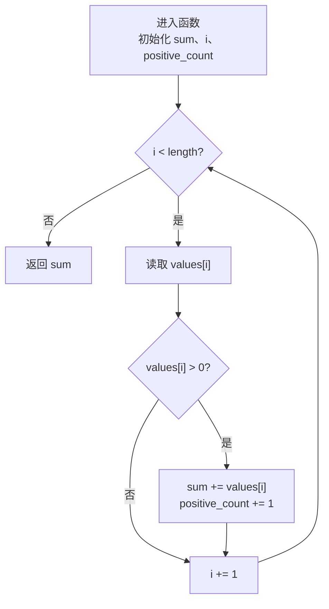

# Lab 1：了解编译器、LLVM IR 与 RISC-V 汇编

_《编译系统原理》实验一全景文档；源程序、生成文件和脚本位于 `lab1/SysY_example/`。_

---

## 📋 摘要

本实验以 `SysY_example.c` 为对象，沿着“源程序—预处理—LLVM IR—RISC-V 汇编—目标文件—链接—模拟器运行”的路径观察编译器各阶段的输入、输出和职责。示例程序包含常量、全局变量、一维数组、数组形参、算术与关系运算、逻辑运算、条件分支、`while` 循环、`int`/`void` 函数、函数调用以及 SysY 运行库输出接口。实验使用 Clang 生成面向 `riscv64-unknown-elf` 的 LLVM IR，使用 `opt` 验证 IR，使用 `llc` 生成 RISC-V 汇编，并使用仓库内的 RISC-V 工具链和模拟器完成目标程序验证。

仓库中已有的验证记录显示，主机参考程序和 RISC-V 模拟器均输出 `28 3 1`，并且 IR 验证、汇编生成、运行库链接和目标程序运行均通过。本文同时记录 WSL 中已安装的 MLIR/AscendNPU-IR 源码工具链、静态 lowering 产物，以及尚未具备 CANN/昇腾设备条件的端到端限制。

## 🔑 关键词

编译器；预处理器；LLVM IR；RISC-V；汇编器；链接器；SysY；运行库；MLIR

## 👥 小组与分工

本实验由两名成员协作完成，分为 LLVM IR 前端分析和 RISC-V 后端分析两部分。

| 成员 | 学号 | 分工 | 主要产物 |
| --- | --- | --- | --- |
| 成员 A（李培涛） | 2411041 | LLVM IR、预处理、IR 验证和结构分析 | `main.tex`、LLVM IR 与结果文件 |
| 成员 B（梁家瑞） | 2411046 | LLVM IR 生成结果的后端处理、RISC-V 汇编阅读、汇编/链接、目标程序和模拟器验证 | `SysY_example.riscv.s`、`build_from_asm.sh`、ELF/反汇编/运行日志 |
| 共同完成 | — | 报告撰写、结果复核、进阶 MLIR 探索 | 本报告及 PDF |

## 🎯 实验要求与完成映射

课件中的要求分为基本要求、报告要求和进阶要求。本仓库的现有材料对应关系如下。

| 课件要求 | 本实验对应内容 | 状态 |
| --- | --- | --- |
| 研究预处理器、编译器各阶段、汇编器和链接器 | “编译器全景流水线”和“分阶段实验命令” | 已覆盖 |
| 设计涵盖语言特性的 SysY 示例 | “示例程序设计”与特性清单 | 已覆盖 |
| 编写/生成等价 LLVM IR | `SysY_example.ll` 与“LLVM IR 阅读与源代码对照” | 已覆盖 |
| 编写/生成等价 ARM 或 RISC-V 汇编 | `SysY_example.riscv.s` 与“RISC-V 汇编阅读” | 已覆盖 |
| 链接 SysY 运行库并验证结果 | `sysy_runtime.c/.h`、`build_and_verify.sh`、`build_from_asm.sh`、“验证结果与证据边界” | 自动脚本和直接装配链路均已覆盖 |
| 以论文规范撰写实验报告 | 本文结构与结果分析 | PDF 已生成 |
| MLIR/AscendNPU IR 逐层 lowering | “进阶：MLIR/AscendNPU IR 探索” | 已完成静态 IR 解析与 HIVM→LLVM lowering；设备侧编译未验证 |

## 🔬 实验目标与背景

### 目标

1. 认识预处理、前端编译、IR 验证、优化/代码生成、汇编、链接和运行的职责边界。
2. 建立 SysY 源代码、LLVM IR、RISC-V 汇编和可执行目标程序之间的对应关系。
3. 用可重复命令生成中间产物，并通过主机结果与 RISC-V 模拟器结果进行交叉核对。
4. 通过局部修改、优化级别和边界输入实验，观察编译器输出如何变化。

### 实验对象

`SysY_example.c` 是不依赖 C 头文件的 SysY 子集程序。它只调用 `putint` 和 `putch`，这两个接口由 `sysy_runtime.h` 声明、由 `sysy_runtime.c` 提供最小适配实现。这样可以把语言特性和运行库实现分开观察。

## 🧭 编译器全景流水线

下面的图表示本实验要观察的完整路径。每个箭头都对应一个可以保存或检查的产物。

```mermaid
flowchart LR
    accTitle: SysY 编译流水线
    accDescr: 从 SysY 源程序开始，依次经过预处理、LLVM IR 生成与验证、RISC-V 汇编生成、汇编和链接，最后在主机或 RISC-V 模拟器上运行。

    source["📥 SysY 源程序\nSysY_example.c"] --> preprocess["⚙️ 预处理\n-E"]
    preprocess --> frontend["⚙️ 前端编译\n词法/语法/语义分析"]
    frontend --> ir["📦 LLVM IR\nSysY_example.ll"]
    ir --> verify["🔍 IR 验证\nopt -passes=verify"]
    verify --> codegen["⚙️ 代码生成\nllc"]
    codegen --> asm["📦 RISC-V 汇编\nSysY_example.riscv.s"]
    asm --> assemble["⚙️ 汇编器\n-c"]
    assemble --> obj["📦 目标文件\n.riscv.o"]
    obj --> link["🔗 链接器\n运行库 + 启动文件"]
    link --> elf["🚀 RISC-V ELF\n.riscv.elf"]
    elf --> run["✅ 模拟器运行\nRV64GC"]

    classDef input fill:#dbeafe,stroke:#2563eb,color:#1e3a5f
    classDef process fill:#fef3c7,stroke:#d97706,color:#78350f
    classDef artifact fill:#dcfce7,stroke:#16a34a,color:#14532d
    classDef check fill:#f3e8ff,stroke:#9333ea,color:#581c87
    class source input
    class preprocess,frontend,codegen,assemble,link,run process
    class ir,asm,obj,elf artifact
    class verify check
```



### 各阶段职责

| 阶段 | 主要工作 | 本实验的观察点 |
| --- | --- | --- |
| 预处理器 | 展开 `#include`、宏和条件编译，输出预处理后的源文本 | `-include sysy_runtime.h` 把运行库声明注入源程序；示例没有直接包含 `stdio.h` |
| 编译器前端 | 词法分析、语法分析、语义分析、类型检查，并建立 IR | `const`、数组、函数、条件、循环和表达式被转换成 LLVM IR 结构 |
| IR 验证/优化 | 检查 IR 是否满足 LLVM 约束，并可进行优化 | `opt -passes=verify` 只做合法性检查；`-O0` 便于保留源代码结构 |
| 代码生成器 | 将目标无关 IR 降低到目标指令集 | `llc -mtriple=riscv64-unknown-elf` 生成 RV64GC 汇编 |
| 汇编器 | 将汇编助记符和伪指令编码为目标文件 | 手工命令把 `.riscv.s` 变为 `.riscv.o` |
| 链接器 | 合并目标文件、运行库、启动文件和符号，解析外部引用 | `sim.specs` 提供模拟器所需的启动和 C 运行库配置 |
| 运行环境 | 加载 ELF 并执行机器码 | `riscv64-unknown-elf-run --model RV64GC` 运行目标程序 |

## 🧩 示例程序设计

### 程序逻辑

程序先定义缩放因子 `2` 和全局计数器 `positive_count`。`main` 创建数组 `[3, -2, 7, 4, -1]`，依次调用三个函数：

1. `scale_array`：用 `while` 遍历数组，将每个元素乘以 `2`，得到 `[6, -4, 14, 8, -2]`。
2. `sum_positive`：累加正数 `6 + 14 + 8 = 28`，并把正数个数写入全局变量，得到 `3`。
3. `classify_average`：计算整数平均值 `28 / 3 = 9` 和余数 `1`。由于平均值不小于 `5` 且余数非负，返回分类值 `1`。

最后使用 `putint` 和 `putch` 输出三个数和换行。

### 覆盖的语言特性

| 特性 | 源程序位置/表现 | IR 或汇编中的典型证据 |
| --- | --- | --- |
| 常量与全局变量 | `scale_factor`、`positive_count` | `constant`、`global`，RISC-V 中的 `%hi/%lo` 符号寻址 |
| 一维数组与数组形参 | `int values[5]`、`int values[]` | `alloca [5 x i32]`、指针参数、`getelementptr` |
| 算术运算 | `+ - * / %` | `add`、`sub`、`mul`、`sdiv`、`srem`；`addw`、`mulw`、`divw`、`remw` |
| 赋值 | 数组元素、局部变量和全局计数器赋值 | `store`/`load`；`lw`/`sw` |
| 关系运算 | `<`、`>`、`==`、`>=` | `icmp slt/sgt/eq/sge`；`bge`、`blt`、`bnez` |
| 逻辑运算 | `&&`、`||`、`!` | 短路条件基本块；多个 `br` 与比较指令 |
| 条件分支 | `if/else`、分类判断 | IR 基本块和条件 `br`；汇编跳转标签 |
| 循环 | 两个 `while` 循环 | 回边 `br` 与 `!llvm.loop`；循环头标签 |
| 函数 | `int`、`void`、函数调用和返回 | `define`/`call`/`ret`；函数标签与 `call` |
| SysY 运行库 | `putint`、`putch` | IR 外部声明和汇编 `call putint/putch` |

## 🛠️ 环境、文件与复现入口

### 工具链

本实验记录的环境为 WSL 中的 Clang/LLVM 18.1.3、RISC-V GCC 15.1.0 和仓库内的 `riscv64-unknown-elf-run`。实际 `clang --version`、`opt --version`、`llc --version` 和 `riscv64-unknown-elf-gcc --version` 输出保存在结果目录的工具版本文件中。

### 文件清单

| 文件 | 作用 |
| --- | --- |
| `SysY_example.c` | SysY/C 兼容示例源程序 |
| `sysy_runtime.h` | `putint`、`putch` 声明 |
| `sysy_runtime.c` | 主机和模拟器可用的最小输出适配层 |
| `SysY_example.ll` | 面向 RISC-V 的 LLVM IR |
| `SysY_example.riscv.s` | LLVM IR 降低后的 RISC-V 汇编 |
| `build_and_verify.sh` | 自动构建、验证和运行脚本 |
| `SysY_example_exercises.md` | IR、控制流、数组寻址和边界实验清单 |
| `build/` | 本地生成的主机可执行文件和 ELF；由 `.gitignore` 排除 |

### 一键复现

在 WSL 中执行：

```bash
cd "/mnt/d/code_warehouse/Curriculum/Compiler Systems/lab1/SysY_example"
bash build_and_verify.sh
```

脚本的五个步骤是：

```text
[1/5] 主机 Clang 编译并运行参考程序
[2/5] Clang 生成 RISC-V LLVM IR
[3/5] opt 验证 IR，llc 生成 RISC-V 汇编
[4/5] RISC-V GCC 链接源程序与运行库
[5/5] RV64GC 模拟器执行 ELF
```

## 🧪 分阶段实验命令

以下命令把自动脚本拆开，便于在报告中展示每一阶段的输入和输出。命令均在 `lab1/SysY_example` 目录执行。

### 预处理器

```bash
clang -E -std=c11 -include sysy_runtime.h \
  SysY_example.c -o build/SysY_example.i
```

检查 `build/SysY_example.i` 中是否出现 `putint`、`putch` 的声明，并观察注释、空白和头文件内容如何影响输出。示例源程序没有直接写 `#include <stdio.h>`，因此这里可以清楚看到强制包含选项的作用。

### 主机参考程序

```bash
clang -std=c11 -Wall -Wextra -Werror \
  -include sysy_runtime.h SysY_example.c sysy_runtime.c \
  -o build/SysY_example.host
./build/SysY_example.host
```

预期输出：

```text
28 3 1
```

这一步只用于建立主机参考结果，不代表已经完成 RISC-V 目标代码验证。

### 生成 LLVM IR

```bash
clang -target riscv64-unknown-elf -march=rv64gc -mabi=lp64d \
  -std=c11 -O0 -S -emit-llvm -include sysy_runtime.h \
  SysY_example.c -o SysY_example.ll
```

`-S -emit-llvm` 要求 Clang 停在 LLVM IR 文本阶段；`-O0` 使局部变量和控制流更接近源程序，适合初次阅读。生成的模块应包含 `target triple = "riscv64-unknown-unknown-elf"`、四个用户函数和两个运行库外部声明。

### 验证和降低 IR

```bash
opt -passes=verify SysY_example.ll -disable-output
llc -mtriple=riscv64-unknown-elf \
  -mattr=+m,+a,+f,+d,+c \
  -filetype=asm SysY_example.ll \
  -o SysY_example.riscv.s
```

`opt` 无输出且返回码为 `0` 表示 IR 结构合法；`llc` 输出的是可读的 RISC-V 汇编文本。若只修改了 `.ll`，应重新运行 `llc`，避免沿用旧的 `.riscv.s` 作为实验结果。

### 直接装配已生成的汇编

为严格观察汇编器，先把 `llc` 的输出装配成目标文件：

```bash
RISCV_GCC="../../riscv-elf-toolchains/bin/riscv64-unknown-elf-gcc"
RISCV_RUN="../../riscv-elf-toolchains/bin/riscv64-unknown-elf-run"

"$RISCV_GCC" -march=rv64gc -mabi=lp64d \
  -c SysY_example.riscv.s \
  -o build/SysY_example.riscv.o
```

其中 `RISCV_GCC` 可以指向仓库内的 `../../riscv-elf-toolchains/bin/riscv64-unknown-elf-gcc`。随后把目标文件和运行库链接：

```bash
"$RISCV_GCC" -march=rv64gc -mabi=lp64d -specs=sim.specs \
  build/SysY_example.riscv.o sysy_runtime.c \
  -o build/SysY_example.from_asm.elf
"$RISCV_RUN" --model RV64GC build/SysY_example.from_asm.elf
```

预期输出仍为 `28 3 1`。这条路径才把 `SysY_example.riscv.s` 本身送入汇编器并参与最终链接。自动脚本中的第 4 步使用 RISC-V GCC 从 `SysY_example.c` 重新编译后链接；它用于验证目标 ABI 和运行库链路，但不能单独证明已生成 `.s` 被装配并链接。

仓库中的 `build_from_asm.sh` 将这条路径固定下来，并额外保存 ELF 信息、最终反汇编和模拟器输出：

```bash
bash build_from_asm.sh
```

结果文件位于 `build/report_results/`：

- `riscv_from_asm.log`：直接装配、链接和运行的完整日志；
- `riscv_from_asm.elf_info.txt`：ELF 头、段表和符号表；
- `riscv_from_asm.disassembly.txt`：最终 ELF 的反汇编；
- `riscv_from_asm.output.txt`：模拟器输出 `28 3 1`。

## 🧠 LLVM IR 阅读与源代码对照

### `scale_array`：循环、数组寻址和写回

在 `SysY_example.ll` 的 `scale_array` 中，可以按以下关系阅读：

| IR 片段 | 含义 |
| --- | --- |
| `alloca ptr`、`alloca i32` | 为数组指针、长度、因子和循环变量建立栈槽 |
| `store i32 0` | 初始化 `i = 0` |
| `icmp slt i32 %9, %10` | 判断 `i < length` |
| `br i1 ...` | 条件成立进入循环体，否则跳到结束块 |
| `sext i32 %14 to i64` | 将 SysY 的 `int` 下标扩展为指针索引宽度 |
| `getelementptr inbounds i32, ptr %13, i64 %15` | 计算 `values[i]` 的地址 |
| `load`、`mul`、`store` | 读取元素、乘以因子并写回 |
| `add nsw i32 %24, 1` | `i = i + 1` |

`getelementptr` 本身不读取内存；它只根据元素类型和索引计算地址。真正读写数组的是紧随其后的 `load` 和 `store`。

### `sum_positive`：控制流图



IR 中的 `%7` 是循环头，`%11` 是元素判断块，`%18` 是正数更新块，`%28` 汇合两条路径并递增 `i`，`%31` 返回总和。这些块与源程序的嵌套 `while`/`if` 结构一一对应。

### `classify_average`：除零保护、除法和逻辑条件

函数先检查 `count == 0`，为真时直接返回 `0`，所以不会执行除法。非零路径执行 `sdiv` 和 `srem`，再将 `average >= 5 && remainder >= 0` 拆成两个条件分支。第二个条件 `average < 0 || !(average >= 5)` 在 IR 中也体现为多个比较和分支块；在 `-O0` 下，编译器保留了较多局部变量和显式跳转，便于观察短路逻辑。

## 🧱 RISC-V 汇编阅读（成员 B：梁家瑞）

本节以 `SysY_example.riscv.s` 为主要实验对象，重点观察 LLVM IR 如何被降低为 RV64GC 指令、函数调用约定如何落实到寄存器和栈帧，以及汇编器和链接器如何把文本汇编变成可执行 ELF。

### 函数序言与栈帧

以 `scale_array` 为例：

```asm
addi  sp, sp, -48
sd    ra, 40(sp)
sd    s0, 32(sp)
addi  s0, sp, 48
```

函数先为栈帧分配空间，保存返回地址 `ra` 和帧指针 `s0`，再把参数与局部变量放入栈槽。函数结束时恢复寄存器并执行 `ret`。

`scale_array` 的栈帧大小为 48 字节，`ra` 保存在 `40(sp)`，`s0` 保存在 `32(sp)`。数组首地址、长度、因子和循环变量分别写入 `-24(s0)`、`-28(s0)`、`-32(s0)` 和 `-36(s0)`。这与 LLVM IR 中的四个 `alloca` 栈槽对应。`main` 还保存了被调用者保存寄存器 `s1`，因此栈帧扩大到 64 字节。

### 数组元素地址

```asm
lw    a1, -36(s0)      # 读取 i
slli  a1, a1, 2        # i * sizeof(int)
add   a0, a0, a1       # 数组首地址 + 偏移
lw    a1, 0(a0)         # 读取 values[i]
```

RV64 中 `int` 是 4 字节，因此下标需要左移 2 位。这个序列对应 LLVM IR 的 `sext` + `getelementptr` + `load`。

汇编层面不再保留 `getelementptr` 这样的抽象地址计算指令，而是由 `slli`、`add` 和访存指令显式完成字节偏移。`lw`/`sw` 访问 32 位整数，`ld`/`sd` 用于 64 位指针、返回地址和保存寄存器。

### 分支、除法和运行库调用

| 源代码含义 | 汇编观察点 |
| --- | --- |
| `i < length` | `bge` 将“不满足循环条件”的路径跳到循环结束 |
| `values[i] > 0` | `blez` 直接跳过非正数路径 |
| `sum / count` | `divw` |
| `sum % count` | `remw` |
| `putint(x)` | `call putint` |
| `putch(32)` / `putch(10)` | 传入空格或换行 ASCII 码后 `call putch` |

`classify_average` 中的 `divw` 和 `remw` 表示对 32 位有符号整数进行除法和取余；`bnez` 实现 `count == 0` 的保护分支，保证除法指令不会在零除数路径执行。`blez` 跳过非正数组元素，`blt` 和 `bltz` 分别实现平均值阈值与负数判断。条件跳转的目标标签 `.LBB2_1` 至 `.LBB2_9` 对应 LLVM IR 中拆分出的基本块。

RISC-V 的整数参数和返回值通过 `a0`--`a7` 传递。调用 `putint` 前，待输出的整数放入 `a0`；调用 `scale_array` 时，数组首地址、长度和因子依次放入 `a0`、`a1`、`a2`。`ra` 保存返回地址，`sp` 管理栈顶，`s0` 作为帧指针，体现了 RV64GC ABI 在本实验中的具体落地。

### 汇编、链接和目标文件检查

`build_from_asm.sh` 将 `llc` 已生成的汇编作为输入，而不是再次从 C 源程序编译。汇编器首先解析 `.text`、`.rodata` 和 `.sbss` 段，编码 `addi`、`lw`、`sw`、`divw`、`remw` 等指令，并为 `positive_count`、`putint` 和 `putch` 保留符号/重定位信息。链接器随后把目标文件与 `sysy_runtime.c` 生成的运行库实现合并，解析外部调用并输出 ELF。

`readelf` 结果可用于确认 ELF 类型、机器架构、入口信息、代码段和数据段；`objdump -d` 则把最终机器码反汇编回可读指令，便于核对四个函数的标签。最终由 `riscv64-unknown-elf-run --model RV64GC` 执行，输出应与主机参考程序一致。

## ✅ 验证结果与证据边界

### 仓库已有验证记录

仓库原有验证记录给出的结果是：

```text
host output: 28 3 1
risc-v output: 28 3 1
all checks passed
```

同时记录了以下检查：

- `opt -passes=verify SysY_example.ll -disable-output` 通过；
- `llc` 成功生成 `SysY_example.riscv.s`；
- RISC-V GCC 使用 `sim.specs` 完成运行库链接；
- `riscv64-unknown-elf-run --model RV64GC` 运行目标程序并得到相同输出。

新增的直接装配链路以 `SysY_example.riscv.s` 为输入，实际在
`build/report_results/riscv_from_asm.output.txt` 中得到 `28 3 1`，并保存了
`riscv_from_asm.elf`、ELF 信息和反汇编。该结果验证了一个关键边界：`llc`
产生的汇编文本可以被汇编器编码、被链接器纳入最终 ELF，并在模拟器上执行。

### 结果解释

主机与 RISC-V 输出相同，说明在当前输入上，源程序的核心计算、分支逻辑、运行库输出和目标执行结果一致。它不能单独证明所有 SysY 程序都被正确编译，也不能替代对 IR、汇编和边界输入的逐项检查。

### 已保存的成员 B 证据

- `build/report_results/riscv_from_asm.log`：直接装配、链接和运行日志；
- `build/report_results/riscv_from_asm.elf`：直接装配链路生成的 ELF；
- `build/report_results/riscv_from_asm.elf_info.txt`：ELF 头、段和符号信息；
- `build/report_results/riscv_from_asm.disassembly.txt`：链接后 ELF 的反汇编；
- `build/report_results/riscv_from_asm.output.txt`：模拟器输出 `28 3 1`；
- `build_from_asm.sh`：以已生成的 `.riscv.s` 为输入的复现脚本。

本次实验没有使用终端截图；文本日志和工具版本文件用于记录命令执行过程。

## 📊 对比实验与边界实验

下列实验来自 `SysY_example_exercises.md`，可直接作为报告的“实验结果扩展”部分。每项都应保存修改前后命令、关键 diff 和输出。

### 修改平均值阈值

把 `average >= 5` 改为 `average >= 10`，重新执行 IR 生成命令，比较 `icmp sge` 的立即数从 `5` 变为 `10`，并记录分类输出变化。该实验把源代码常量变化与 IR 比较指令的变化直接对应起来。

### 优化级别对比

```bash
clang -target riscv64-unknown-elf -march=rv64gc -mabi=lp64d \
  -O0 -S -emit-llvm -include sysy_runtime.h \
  SysY_example.c -o build/SysY_example.O0.ll
clang -target riscv64-unknown-elf -march=rv64gc -mabi=lp64d \
  -O2 -S -emit-llvm -include sysy_runtime.h \
  SysY_example.c -o build/SysY_example.O2.ll
```

比较局部变量栈槽、`load/store` 数量、循环结构、函数属性和是否出现更积极的常量传播。不要只比较文件大小；应至少列出三处可定位的 IR 差异。

### 零长度数组边界

将调用改为 `sum_positive(values, 0)`，运行 `classify_average(sum, positive_count)`，确认 `count == 0` 分支返回 `0`，不会执行 `sdiv`/`srem`。同时说明这是程序逻辑提供的除零保护，不是 LLVM 自动替程序员修复错误输入。

### 输入与输出对照表

| 变体 | 预期观察 |
| --- | --- |
| 默认数组、阈值 5 | `28 3 1` |
| 阈值改为 10 | 平均值仍为 9，分类分支应变化；需以实际运行输出为准 |
| `count = 0` | `classify_average` 返回 `0` |
| `-O0` 与 `-O2` | 语义输出一致，IR 结构和指令数量可能变化 |

## 🧬 进阶：MLIR/AscendNPU IR 探索

课件把 MLIR/AscendNPU IR 列为 1 分进阶要求。它不是本仓库现有自动验证链路的一部分；本次在 WSL Ubuntu 24.04 中完成了源码构建，并保存了可复核的静态 lowering 结果。工具版本和命令记录见 `build/report_results/ascendnpu_toolchain_versions.txt`。

### 探索问题

1. VecAdd 示例的输入方言、目标方言和最终硬件相关表示分别是什么？
2. 每次 lowering 消除了哪些抽象操作，又引入了哪些布局、类型或硬件约束？
3. 哪一步是通用 MLIR pass，哪一步依赖 AscendNPU/昇腾后端？
4. 与本实验的单层 LLVM IR 相比，多级方言如何保留更高层语义并延后硬件决策？

### 记录表

| 层级 | 输入方言/文件 | 使用的 pass 或命令 | 输出方言/文件 | 观察 |
| --- | --- | --- | --- | --- |
| 1 | `arith`/`func`，`ascendnpu_smoke_input.mlir` | `bishengir-opt --convert-arith-to-llvm --convert-func-to-llvm` | LLVM 方言，`ascendnpu_smoke_llvm.mlir` | 验证通用 arith/func→LLVM lowering |
| 2 | AscendNPU `hivm.hir` VecAdd，`ascendnpu_vecadd_parsed.mlir` | `bishengir-opt`（无变换，仅解析/打印） | HIVM 方言保持，包含 GM/UB 地址空间与 `hivm.hir.vadd` | 验证 AscendNPU 方言注册和输入 IR 可读 |
| 3 | HIVM 转换测试输入，`ascendnpu_hivm_conversion_input.mlir` | `bishengir-opt --split-input-file --convert-hivm-to-llvm` | LLVM 方言（`llvm.func`、地址空间指针、LLVM intrinsic），`ascendnpu_hivm_to_llvm.mlir` | 实测完成 AscendNPU HIVM→LLVM 静态 lowering |

### 参考入口

- [AscendNPU IR 快速入门与 VecAdd 示例](https://ascendnpu-ir.gitcode.com/zh_cn/sources/introduction/quick_start/examples_zh.html)
- [AscendNPU-IR 源码安装指南](https://github.com/Ascend/AscendNPU-IR/blob/master/docs/source/en/introduction/quick_start/installing_guide.md)
- [昇腾 CANN BiSheng 文档](https://www.hiascend.com/cann/bisheng)

本次只验证了工具启动、标准 MLIR 解析和 HIVM→LLVM 静态 lowering；没有安装 CANN，也没有 Ascend NPU，因此没有把 `bishengir-compile` 生成设备目标或硬件运行写成已完成结果。

## 📝 结论

本实验用一个覆盖面较完整的 SysY 子集程序，把编译器的主要产物串联起来：预处理阶段注入运行库声明，Clang 前端把源程序表示为 LLVM IR，`opt` 检查 IR 合法性，`llc` 把 IR 降低为 RV64GC 汇编，汇编器把文本指令编码为目标文件，链接器将目标文件、启动文件和运行库合成为 ELF，模拟器最后执行 ELF。现有记录中的主机与 RISC-V 输出均为 `28 3 1`，支持当前示例上的语义一致性结论。

实验还说明了验证范围：自动脚本的 RISC-V ELF 链接路径从 C 源重新编译，生成的 `.riscv.s` 需要额外执行“汇编—目标文件—链接”命令，才能把该文件本身纳入最终执行路径。通过阈值修改、`-O0/-O2` 对比和零长度输入实验，可以进一步把源代码变化与 IR/汇编变化建立因果对应。
